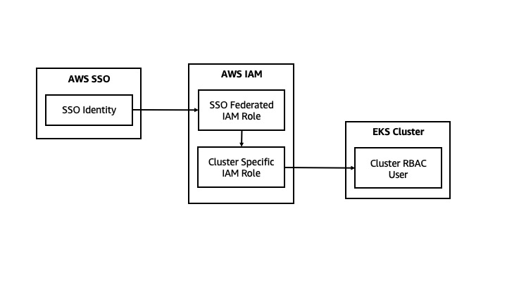
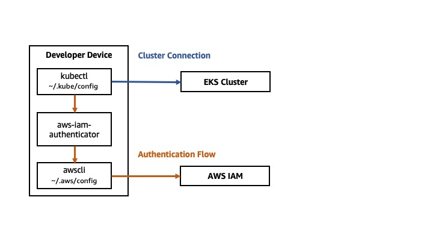

# Tutorial: Enable Developer Access to Clusters with AWS SSO



AWS SSO automates connecting developers to EKS clusters, when configured properly.

This guide covers authenticating to the Kubernetes API server using AWS SSO. Developers authenticate to the AWS CLI with an external identity, and the EKS control plane maps a federated IAM Role to a user in the Kubernetes RBAC system. 

This authentication flow includes multiple identities:
1. SSO Identity, managed through AWS SSO or externally (e.g., Okta)
2. Federated SSO IAM Role assumed via federation through AWS SSO
3. Cluster Specific IAM Role 
3. Kubernetes RBAC User

This guide assumes AWS SSO is configured with accounts for your developers. 

## Configure Control Plane

Configure the IAM role that SSO users will use to interact with your EKS cluster.

SSO users will assume a first federated SSO Role in the account, and then assume a second cluster specific role. This method provides granular control over the IAM identity, which is appropriate given the authentication model of EKS. 

Note: EKS provides cluster access by mapping IAM Identity ARN values to cluster policies. More specifically, this mapping of IAM identities to cluster users does not support conditions and doesn't consider any policies attached to the IAM identity.

1. Create Cluster Specific IAM Role

Within the account hosting the cluster, create an IAM role. This IAM role does not need any particular permission attached. Read only permissions associated with EC2 and EKS may be appropriate. 

Define a trust relationship. The cluster specific role should trust a federated SSO role. The federated SSO role must have the ability to perform the action `sts:AssumeRole` for the cluster specific role.

**CloudFormation**

Create a `cluster-dev-role.yaml` file:
```
AWSTemplateFormatVersion: "2012-10-17"
Resources:
  RootRole:
    Type: 'AWS::IAM::Role'
    Properties:
      AssumeRolePolicyDocument:
        Version: "2012-10-17"
        Statement:
          - Effect: Allow
            Resource: 'arn:aws:iam::account-id:role/<SSO-Dev>'
            Action:
              - 'sts:AssumeRole'
      RoleName: '<ClusterA-Dev>'
```

Apply the CloudFormation:
```
aws cloudformation create-stack \
  --stack-name ClusterDevRole \
  --template-body file://$(pwd)/cluster-dev-role.yam.yaml \
  --capabilities CAPABILITY_NAMED_IAM
```  
**Terraform**

Create a `cluster-dev-role.tf` file:
```
resource "aws_iam_role" "<ClusterA-Dev>" {
  name = "<ClusterA-Dev>"

  # Terraform's "jsonencode" function converts a
  # Terraform expression result to valid JSON syntax.
  assume_role_policy = jsonencode({
    Version = "2012-10-17"
    Statement = [
      {
        Action = "sts:AssumeRole"
        Effect = "Allow"
        Sid    = ""
        Resource = "arn:aws:iam::account-id:role/<SSO-Dev>"
      },
    ]
  })
}
```

Create the IAM role:
```
terraform apply
```

2. Use a tool to modify the "aws-auth" ConfigMap in the cluster. 

**eksctl**

```
 eksctl create iamidentitymapping --cluster  <cluster-name> --region=<region> --arn arn:aws:iam::<account-number>:role/<ClusterA-Dev> --group system:masters --username <ClusterA-Dev>
 ```

 Review eksctl docs for creating [IAM Identity Mappings](https://eksctl.io/usage/iam-identity-mappings/).

**kubectl**

Create an `aws-auth-cm.yaml` file:
```
apiVersion: v1
kind: ConfigMap
metadata:
  name: aws-auth
  namespace: kube-system
data:
  mapRoles: |
    - rolearn: arn:aws:iam::<account-number>:role/<ClusterA-Dev>
      username: <ClusterA-Dev>
      groups:
        - system:masters
```

```
kubectl apply -f aws-auth-cm.yaml
```

Review the Kubernetes documentation for [Role Based Access Control (RBAC).](https://kubernetes.io/docs/reference/access-authn-authz/rbac/)

## Setup User Device



1. Install Prerequisite Tools

- [AWS CLI](https://docs.aws.amazon.com/cli/latest/userguide/getting-started-install.html)
- [AWS IAM Authenticator for Kubernetes](https://github.com/kubernetes-sigs/aws-iam-authenticator)
- [kubectl](https://kubernetes.io/docs/tasks/tools/)

1. Configure AWS CLI for AWS SSO. 

Create a [named profile](https://docs.aws.amazon.com/cli/latest/userguide/cli-configure-profiles.html) in the AWS CLI. Populate this profile with your [AWS SSO information](https://docs.aws.amazon.com/cli/latest/userguide/cli-configure-sso.html). 

```
vi ~/.aws/config
```

```
[profile <SSO-role>]
sso_start_url = <sso-start-url>
sso_region = <region>
sso_account_id = <account-number>
sso_role_name = <sso-role-name>
region = <region>
output = json
```

1. Create a new [profile for an assumed role](https://docs.aws.amazon.com/cli/latest/userguide/cli-configure-role.html#cli-role-overview).

In `~/.aws/config`:

```
[profile <ClusterA-Dev>]
role_arn = arn:aws:iam::<account-number>:role/<ClusterA-Dev>
source_profile = <SSO-role>
```

Set an environment variable to use the 

```
export AWS_PROFILE=ClusterA-Dev
```


1. Write kubeconfig

**eksctl**

```
eksctl utils write-kubeconfig -c <cluster-name> -r <region> -p <profile_name>
```

Note that this adds a context to your kubeconfig for the identified cluster, and associates the AWS CLI profile with the cluster. You may use a different profile (or default profile) in different terminal sessions, for example. 

For more info, see `eksctl utils write-kubeconfig -h`.

**AWS CLI**

```
aws eks update-kubeconfig --region <region> --name <cluster-name>
```

For more information, see the [AWS CLI EKS documentation](https://awscli.amazonaws.com/v2/documentation/api/latest/reference/eks/update-kubeconfig.html).

1. Access EKS Cluster

Kubectl is now configured to securely access your cluster based on a SSO identity.

```
kubectl get nodes
```

Additionally, tools such as `k9s` and `lens` can access your cluster, provided you are authenticated to the AWS CLI. To check if you are properly authenticated, use `aws sts get-caller-identity`.


