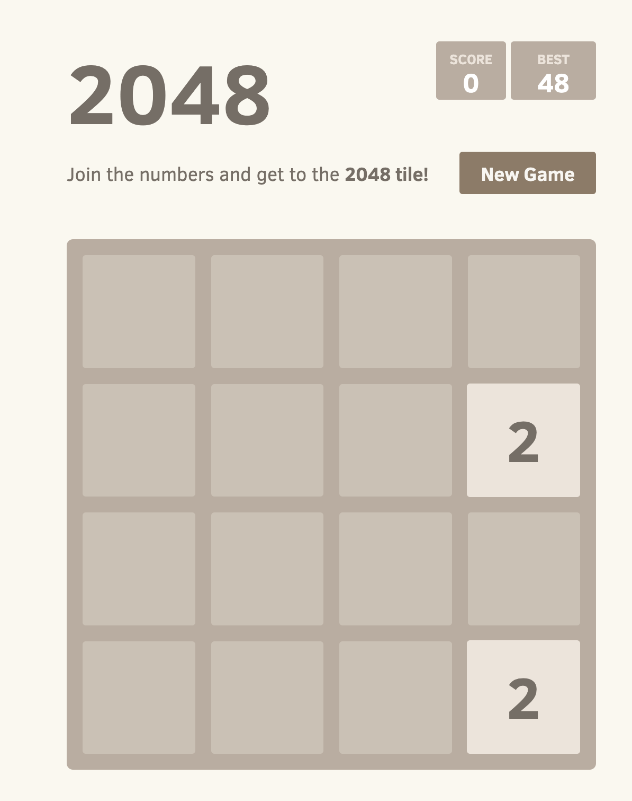

include::attributes.txt[]

[.topic]
[#quickstart]
= Quickstart: Deploy a web app and store data
:info_titleabbrev: Quickstart

[abstract]
--
Deploy a game application and persist its data on Amazon EKS
--

This quickstart tutorial guides you through the steps to deploy the 2048 game sample application and persist its data on an Amazon EKS Auto Mode cluster using https://eksctl.io/[eksctl]. 

<<automode,Amazon EKS Auto Mode>> simplifies cluster management by automating routine tasks like block storage, networking, load balancing, and compute autoscaling. During setup, it handles creating nodes with EC2 managed instances, application load balancers, and EBS volumes.

In summary, you'll deploy a sample workload with the custom annotations needed for seamless integration with {aws} services.

== In this tutorial

Using the `eksctl` cluster template that follows, you'll build a cluster with EKS Auto Mode for automated node provisioning. 

- *VPC Configuration*: When using the eksctl cluster template that follows, eksctl automatically creates an IPv4 Virtual Private Cloud (VPC) for the cluster. By default, eksctl configures a VPC that addresses all networking requirements, in addition to creating both public and private endpoints.
- *Instance Management*: EKS Auto Mode dynamically adds or removes nodes in your EKS cluster based on the demands of your Kubernetes applications.
- *Data Persistence*: Use the block storage capability of EKS Auto Mode to ensure the persistence of application data, even in scenarios involving pod restarts or failures. 
- *External App Access*: Use the load balancing capability of EKS Auto Mode to dynamically provision an Application Load Balancer (ALB).

== Prerequisites

Before you start, make sure you have performed the following tasks:

* link:eks/latest/userguide/setting-up.html[Setup your environment for Amazon EKS,type="documentation"]
* https://eksctl.io/installation/[Install the latest version of eksctl]

== Configure the cluster

In this section, you'll create a cluster using EKS Auto Mode for dynamic node provisioning.

Create a `cluster-config.yaml` file and paste the following contents into it. Replace `region-code` with a valid Region (e.g., `us-east-1`).

```yaml
apiVersion: eksctl.io/v1alpha5
kind: ClusterConfig

metadata:
  name: web-quickstart
  region: <region-code>

autoModeConfig:
  enabled: true
```
Now, we're ready to create the cluster. 

Create the EKS cluster using the `cluster-config.yaml``:

```bash
eksctl create cluster -f cluster-config.yaml
```

[IMPORTANT]
====
If you do not use eksctl to create the cluster, you need to manually tag the VPC subnets. 
====


== Create IngressClass

Create a Kubernetes `IngressClass` for EKS Auto Mode. The IngressClass defines how EKS Auto Mode handles Ingress resources. This step configures the load balancing capability of EKS Auto Mode. When you create Ingress resources for your applications, EKS Auto Mode uses this IngressClass to automatically provision and manage load balancers, integrating your Kubernetes applications with {aws} load balancing services.

Save the following yaml file as `ingressclass.yaml`:

```yaml
apiVersion: networking.k8s.io/v1
kind: IngressClass
metadata:
  name: alb
  annotations:
    ingressclass.kubernetes.io/is-default-class: "true" 
spec:
  controller: eks.amazonaws.com/alb
```

Apply the IngressClass to your cluster:

```cli
kubectl apply -f ingressclass.yaml
```

==  Deploy the 2048 game sample application

In this section, we walk you through the steps to deploy the popular "`2048 game`" as a sample application within the cluster. The provided manifest includes custom annotations for the Application Load Balancer (ALB). These annotations integrate with and instruct the EKS to handle incoming HTTP traffic as "internet-facing" and route it to the appropriate service in the `game-2048` namespace using the target type "ip". 

[NOTE]
====
The `docker-2048` image in the example is an `x86_64` container image and will not run on other architectures.
====

. Create a Kubernetes namespace called `game-2048` with the `--save-config` flag.
+
[source,bash,subs="verbatim,attributes"]
----
kubectl create namespace game-2048 --save-config
----
+
You should see the following response output:
+
[source,bash,subs="verbatim,attributes"]
----
namespace/game-2048 created
----
. Deploy the https://raw.githubusercontent.com/kubernetes-sigs/aws-load-balancer-controller/v2.8.0/docs/examples/2048/2048_full.yaml[2048 Game Sample application].
+
[source,bash,subs="verbatim,attributes"]
----
kubectl apply -n game-2048 -f https://raw.githubusercontent.com/kubernetes-sigs/aws-load-balancer-controller/v2.8.0/docs/examples/2048/2048_full.yaml
----
+
This manifest sets up a Kubernetes Deployment, Service, and Ingress for the `game-2048` namespace, creating the necessary resources to deploy and expose the `game-2048` application within the cluster. It includes the creation of a service named `service-2048` that exposes the deployment on port `80`, and an Ingress resource named `ingress-2048` that defines routing rules for incoming HTTP traffic and annotations for an internet-facing Application Load Balancer (ALB). You should see the following response output: 
+
[source,bash,subs="verbatim,attributes"]
----
namespace/game-2048 configured
deployment.apps/deployment-2048 created
service/service-2048 created
ingress.networking.k8s.io/ingress-2048 created
----
. Run the following command to get the Ingress resource for the `game-2048` namespace.
+
[source,bash,subs="verbatim,attributes"]
----
kubectl get ingress -n game-2048
----
+
You should see the following response output:
+
[source,bash,subs="verbatim,attributes"]
----
NAME           CLASS   HOSTS   ADDRESS                                                                    PORTS   AGE
ingress-2048   alb     *       k8s-game2048-ingress2-eb379a0f83-378466616.region-code.elb.amazonaws.com   80      31s
----
+
You'll need to wait several minutes for the Application Load Balancer (ALB) to provision before you begin the following steps.
. Open a web browser and enter the `ADDRESS` from the previous step to access the web application. For example:
+
[source,bash,subs="verbatim,attributes"]
----
k8s-game2048-ingress2-eb379a0f83-378466616.region-code.elb.amazonaws.com
----
+
You should see the 2048 game in your browser. Play!
+



== Persist Data using Amazon EKS Auto Mode

Now that the 2048 game is up and running on your Amazon EKS cluster, it's time to ensure that your game data is safely persisted using the block storage capability of Amazon EKS Auto Mode. 

. Create a file named `storage-class.yaml`:
+
[source,yaml]
----
apiVersion: storage.k8s.io/v1
kind: StorageClass
metadata:
  name: auto-ebs-sc
  annotations:
    storageclass.kubernetes.io/is-default-class: "true"
provisioner: ebs.csi.eks.amazonaws.com
volumeBindingMode: WaitForFirstConsumer
parameters:
  type: gp3
  encrypted: "true"
----
. Apply the `StorageClass`:
+
[source,bash]
----
kubectl apply -f storage-class.yaml
----
. Create a Persistent Volume Claim (PVC) to request storage for your game data. Create a file named `ebs-pvc.yaml` and add the following content to it:
+
[source,bash,subs="verbatim,attributes"]
----
apiVersion: v1
kind: PersistentVolumeClaim
metadata:
  name: game-data-pvc
  namespace: game-2048
spec:
  accessModes:
    - ReadWriteOnce
  resources:
    requests:
      storage: 10Gi
  storageClassName: auto-ebs-sc
----
. Apply the PVC to your cluster:
+
[source,bash,subs="verbatim,attributes"]
----
kubectl apply -f ebs-pvc.yaml
----
+
You should see the following response output:
+
[source,bash,subs="verbatim,attributes"]
----
persistentvolumeclaim/game-data-pvc created
----
. Now, you need to update your 2048 game deployment to use this PVC for storing data. The following deployment is configured to use the PVC for storing game data. Create a file named `ebs-deployment.yaml` and add the following contents to it:
+
[source,bash,subs="verbatim,attributes"]
----
apiVersion: apps/v1
kind: Deployment
metadata:
  namespace: game-2048
  name: deployment-2048
spec:
  replicas: 3  # Adjust the number of replicas as needed
  selector:
    matchLabels:
      app.kubernetes.io/name: app-2048
  template:
    metadata:
      labels:
        app.kubernetes.io/name: app-2048
    spec:
      containers:
        - name: app-2048
          image: public.ecr.aws/l6m2t8p7/docker-2048:latest
          imagePullPolicy: Always
          ports:
            - containerPort: 80
          volumeMounts:
            - name: game-data
              mountPath: /var/lib/2048
      volumes:
        - name: game-data
          persistentVolumeClaim:
            claimName: game-data-pvc
----
. Apply the updated deployment:
+
[source,bash,subs="verbatim,attributes"]
----
kubectl apply -f ebs-deployment.yaml
----
+
You should see the following response output:
+
[source,bash,subs="verbatim,attributes"]
----
deployment.apps/deployment-2048 configured
----

With these steps, your 2048 game on the cluster is now set up to persist data using the block storage capability of Amazon EKS Auto Mode. This ensures that your game progress and data are safe even in the event of pod or node failures. 

If you liked this tutorial, let us know by providing feedback so we're able to provide you with more use case-specific quickstart tutorials like this one.


== Clean up

To avoid incurring future charges, you need to delete the associated CloudFormation stack manually to delete all resources created during this guide, including the VPC network.

Delete the CloudFormation stack:

```bash
eksctl delete cluster -f ./cluster-config.yaml
```